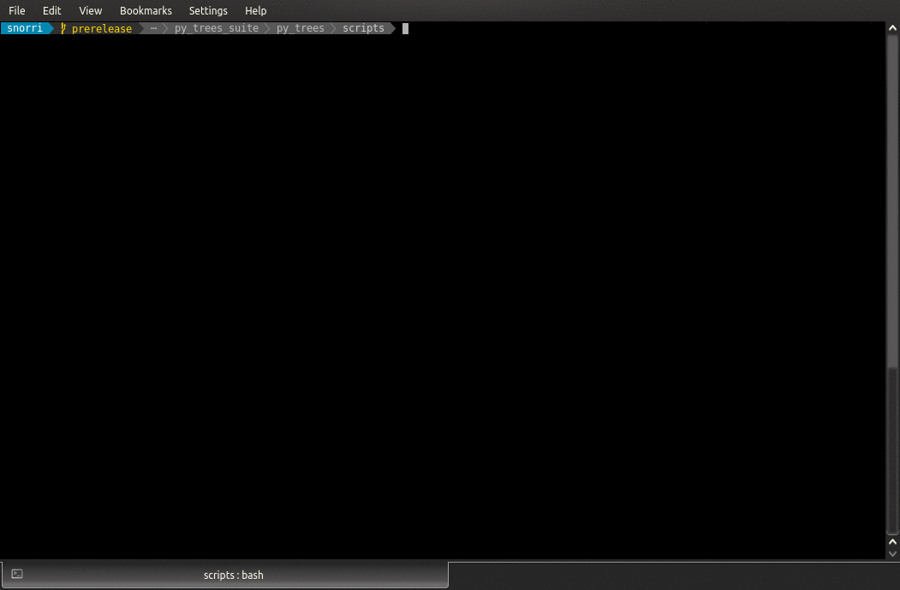

Behaviours
==========

A :py:class:`~py_trees.behaviour.Behaviour` is the smallest element in a
behaviour tree, i.e. it is the *leaf*. Behaviours are usually representative of
either a check (am I hungry?), or an action (buy some chocolate cookies).

Skeleton
--------

Behaviours in py_trees are created by subclassing the
:class:`~py_trees.behaviour.Behaviour` class. A skeleton example with
informative comments is in :ref:`skeleton_behaviour`, shown below.

.. literalinclude:: examples/skeleton_behaviour.py
   :language: python
   :linenos:
   :name: skeleton_behaviour

Lifecycle
---------

Getting a feel for how this works in action can be seen by running
the :ref:`py-trees-demo-behaviour-lifecycle-label` program (click the link to browse the source):

Important points to focus on:

* The :meth:`~py_trees.demos.lifecycle.Counter.initialise()` method kicks in only when the behaviour is not already running
* The parent :meth:`~py_trees.behaviour.Behaviour.tick()` method is responsible for determining when to call
  :meth:`~py_trees.demos.lifecycle.Counter.initialise()`,
  :meth:`~py_trees.demos.lifecycle.Counter.stop()` and
  :meth:`~py_trees.demos.lifecycle.Counter.terminate()` methods.
* The parent :meth:`~py_trees.behaviour.Behaviour.tick()` method always calls update()
* The :meth:`~py_trees.demos.lifecycle.Counter.update()` method is responsible for deciding the behaviour :ref:`status-section`.

Initialisation
--------------

With no less than three methods used for initialisation, it can be difficult to identify where your initialisation code
needs to lurk.

.. note:: ``__init__`` should instantiate the behaviour sufficiently for offline dot graph generation

Later we'll see how we can render trees of behaviours in dot graphs. For now, it is sufficient to understand
that you need to keep this minimal enough so that you can generate dot graphs for your trees from
something like a CI server (e.g. Jenkins). This is a very useful thing to be able to do.

* No hardware connections that may not be there, e.g. usb lidars
* No middleware connections to other software that may not be there, e.g. ROS pubs/subs/services
* No need to fire up other needlessly heavy resources, e.g. heavy threads in the background

.. note:: ``setup`` handles all other one-time initialisations of resources that are required for execution

Essentially, all the things that the constructor doesn't handle - hardware connections, middleware and other heavy resources.

.. note:: ``initialise`` configures and resets the behaviour ready for (repeated) execution

Initialisation here is about getting things ready for immediate execution of a task. Some examples:

* Initialising/resetting/clearing variables
* Starting timers
* Just-in-time discovery and establishment of middleware connections
* Sending a goal to start a controller running elsewhere on the system
* ...

.. _status-section:

Status
------

The most important part of a behaviour is the determination of the behaviour's status
in the ``update()`` method. The status gets used to affect which direction
of travel is subsequently pursued through the remainder of a behaviour tree. We haven't gotten
to trees yet, but it is this which drives the decision making in a behaviour tree.

.. autoclass:: py_trees.common.Status
    :members:
    :noindex:

The ``update()`` method must return one of ``RUNNING``. ``SUCCESS`` or ``FAILURE``. A
status of ``INVALID`` is the initial default and ordinarily automatically set by other
mechansims (e.g. when a higher priority behaviour cancels the currently selected one).

Feedback Message
----------------

.. literalinclude:: ../py_trees/demos/lifecycle.py
   :language: python
   :linenos:
   :lines: 91-94

A behaviour has a naturally built in feedback message that can be
cleared in the ``initialise()`` or ``terminate()`` methods and updated
in the ``update()`` method.

.. tip:: Alter a feedback message when **significant events** occur.

Other techniques will be introduced later if you wish to store monitoring data
at every tick and these allow you to store it in structures more versatile than
a string. The feedback message is instead used to assist in
understanding where significant changes to a behaviour tree happen. These
can occur in the change of status of behaviours in the tree OR they can
occur at critical points in a ``RUNNING`` behaviour (where the status of
the tree is otherwise static). The feedback
message variable should be used to expressed when the latter occurs and can be
useful for tree monitoring visualisations, or to decide when to log the
state of a tree.

Example - a behaviour responsible for a planner that takes several minutes
to plan and execute a plan. In this time, the behaviour is in the ``RUNNING``
state. Avoid updating it with a feedback message at very tick with an updated ETA.
Instead, update the message whenever significant events occur - e.g. when
re-planning occurs on the fly.

Complex Example
---------------

Here we present a more complicated example that illustrates a few
concepts discussed above, but not present in the very simple lifecycle
:class:`~py_trees.demos.lifecycle.Counter` behavour.

* Connects to an external process in the ``setup`` method
* Requests a new goal to start with the external process in the ``initialise`` method
* Monitors the goal status in the ``update`` method
* Determines ``RUNNING``/``SUCCESS`` pending the percentage completed feedback from the external process

.. note:: A behaviour's ``update()`` method never blocks, at most it just monitors the
    progress and holds up any decision making required by a tree that is ticking the
    behaviour by setting it's status to ``RUNNING``. At the risk of being confusing, this
    is what is generally referred to as a :term:`blocking` behaviour.

Running the :ref:`py-trees-demo-action-behaviour-program` program (click the link to browse the source):

.. image:: images/action.gif

Cheat Sheet
-----------

* Keep the constructor minimal
* Hardware or other runtime specific initialisation in ``setup``
* Update feedback messages for **significant events** only
* A behaviour's ``update()`` method must be light and non-blocking

