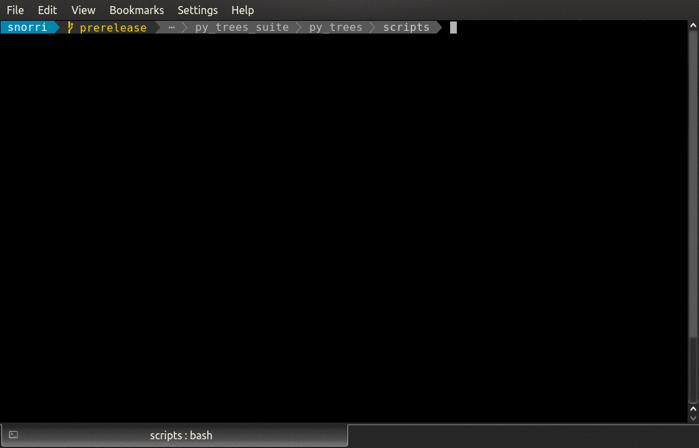

Composites
==========

Composites are the **factories** and **decision makers** of a
behaviour tree. They are responsible for shaping the branches.

.. graphviz:: dot/composites.dot

.. tip:: You should never need to subclass or create new composites.

Most patterns can be achieved with a combination of the above. Adding to this
set exponentially increases the complexity and subsequently
making it more difficult to design, introspect, visualise and debug the trees. Always try
to find the combination you need to achieve your result before contemplating adding
to this set. Actually, scratch that...just don't contemplate it!

Composite behaviours typically manage children and apply some logic to the way
they execute and return a result, but generally don't do anything themselves.
Perform the checks or actions you need to do in the non-composite behaviours.

* :class:`~py_trees.composites.Sequence`: execute children sequentially
* :class:`~py_trees.composites.Selector`: select a path through the tree, interruptible by higher priorities
* :class:`~py_trees.composites.Chooser`: like a selector, but commits to a path once started until it finishes
* :class:`~py_trees.composites.Parallel`: manage children concurrently

Sequence
--------

.. autoclass:: py_trees.composites.Sequence
    :noindex:

----

The :ref:`py-trees-demo-sequence-program` (click to browse the source) program populates a sequence with 2-tick jobs that runs through to completion.

.. image:: images/sequence.gif

Selector
--------

.. autoclass:: py_trees.composites.Selector
    :noindex:

----

The :ref:`py-trees-demo-selector-program` program (click to browse the source) demonstrates the effects of
higher priority switching/interruption. In this example the higher priority child is setup to fail initially,
falling back to the continually running second child. On the third
tick, the first child succeeds and cancels the hitherto running child.

.. image:: images/selector.gif

Chooser
-------

.. autoclass:: py_trees.composites.Chooser
    :noindex:

Parallel
--------

.. autoclass:: py_trees.composites.Parallel
    :noindex:

----

The :ref:`py-trees-demo-context-switching-program` program (click to browse the source) illustrates a parallel
used to enable context switching before and after a work sequence has run. This is done by backing up and
setting the new context in the ``initialise()`` function and restoring the original context in the ``terminate()``
function.

----

.. graphviz:: dot/naive_context_switching.dot

.. attention:: Using separate set and reset behaviours at the front and back of a sequence will not suffice. In the case
    that one of the work behaviours in the sequence fails, the final reset context switch will never trigger. As a
    parallel behaviour, it will trigger whether the sequence fails or succeeds.

